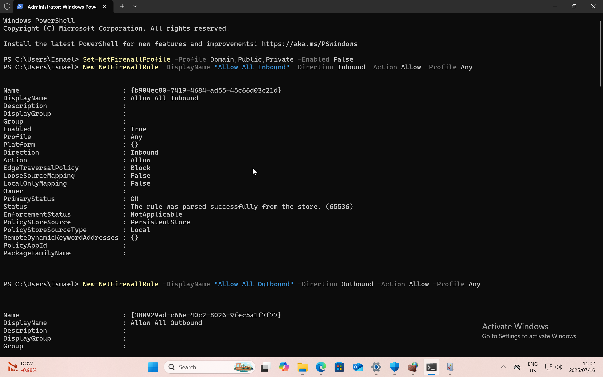
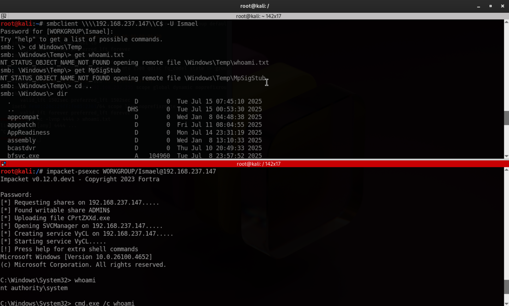

# 👨‍💻 SOC Lateral Movement Detection Lab 🚀

## 📚 Table of Contents
1. [📌 Introduction] (#introduction)
2.	[🔧 Prerequisites] (#prerequisites)
	3.	[Network Topology] (#network-topology)
	4.	[Step 1: Setting Up Virtual Machines] (#step-1-setting-up-virtual-machines)
	5.	[Step 2: ⚙️ Windows 11 Vulnerable Configuration] (#step-2-windows-11-vulnerable-configuration)
	6.	[Step 3: 🐾 Installing Sysmon] (#step-3-installing-sysmon)
	7.	[Step 4: 📈 Installing Splunk] (#step-4-installing-splunk)
	8.	[Step 5: 🔮 Attack Simulation (Kali Linux)] (#step-5-attack-simulation-kali-linux)
	9.	[Step 6: 🔎 Detecting & Analyzing Logs in Splunk] (#step-6-detecting-&-analyzing-logs-in-splunk)
	10.	[🎯 Attack Mapping & Interpretation] (#attack-mapping-&-interpretation)
	11.	[📂 Artifacts] (#artifacts)
	12.	[🛠️ Next Steps & Future Improvements] (#next-steps-&future-improvements)
	13.	[➕ How to Contribute] (#how-to-contribute)
	14.	[🏁 Conclusion] (#conclusion)
	15.	[🔗 Credits & Tools] (#credits-&-tools)
	16.	[📧 Connect with Me] (#connect-with-me)

⸻

## 📌 Introduction

This project simulates a lateral movement and remote command execution attack from a Kali Linux machine against a Windows 11 target. The goal is to detect these activities using Splunk and Sysmon, providing hands-on experience for Blue Team operations.
⸻

## 🔧 Prerequisites

Requirement	Description
RAM	At least 12GB (preferably 16GB+)
Virtualization Software	VMware, VirtualBox, or UTM (Mac M1/M2)
Operating Systems	Windows 11 & Kali Linux
Logging Tools	Splunk Enterprise & Sysmon
Network	Both VMs must be in the same local network


⸻

## Network Topology

	```
	[Kali Linux (Attacker)]  --->  [Windows 10 VM (Target)]  --->  [Splunk (Log Monitoring)]
	```
*Kali performs attacks on the Windows machine; Splunk monitors the logs.

⸻

## Step 1: Setting Up Virtual Machines

### 1.1 Kali Linux (Attacker)
	1.	Download Kali Linux ISO from kali.org.
	2.	Install using VMware/VirtualBox/UTM.
	3.	Update system:
	```bash
	sudo apt update && sudo apt upgrade -y
	```

	4.	Install tools:
	```bash
	sudo apt install impacket crackmapexec smbclient
	```


### 1.2 Windows 11 (Victim)
	1.	Download Windows 11 ISO from Microsoft’s website.
	2.	Create a VM and install Windows 11.
	3.	Ensure networking allows communication with Kali.

⸻

## Step 2: ⚙️ Windows 11 Vulnerable Configuration

🛡️ Disable Defender
	```powershell
	Set-MpPreference -DisableRealtimeMonitoring $true
	Set-MpPreference -DisableBehaviorMonitoring $true
	Set-MpPreference -DisableBlockAtFirstSeen $true
	Set-MpPreference -DisableIOAVProtection $true
	```

🔥 Disable Firewall
	```powershell
	Set-NetFirewallProfile -Profile Domain,Public,Private -Enabled False
	```


📂 Enable Admin Shares
	```powershell
	reg add "HKLM\SOFTWARE\Microsoft\Windows\CurrentVersion\Policies\System" /v LocalAccountTokenFilterPolicy /t REG_DWORD /d 1 /f
	```

💻 Enable Command Line Logging
	```powershell
	reg add "HKLM\Software\Microsoft\Windows\CurrentVersion\Policies\System\Audit" /v ProcessCreationIncludeCmdLine_Enabled /t REG_DWORD /d 1 /f
	```


⸻

## Step 3: 🐾 Installing Sysmon
	1.	Download Sysmon from Microsoft Sysinternals.
	2.	Get a pre-configured sysmonconfig.xml from Sysmon Modular.
	3.	Install Sysmon on PowerShell as Administrator:
	```powershell
	cd "C:\Users\Downloads\sysmon"
	.\sysmon64.exe -i sysmonconfig.xml
	```

	4.	Verify:
	```powershell
	Get-Process sysmon64
	```


⸻

## Step 4: 📈 Installing Splunk
	1.	Download Splunk Enterprise from Splunk website.
	2.	Install and run Splunk on Windows 11.
	3.	Configure inputs to monitor:
	•	WinEventLog: Security
	•	WinEventLog: System
	•	Sysmon logs
	•	PowerShell Operational logs
	4.	Confirm data ingestion.

⸻

## Step 5: 🔮 Attack Simulation (Kali Linux)

5.1 Lateral Movement with impacket-psexec
	```bash
	impacket-psexec WORKGROUP/Administrator@192.168.X.X -p < VICTIM_PORT_EX_445 >
	```



Generates:
	•	4624 (Logon Type 3) – Remote Network Logon

5.2 Accessing Admin Shares with smbclient
	```bash
	smbclient \\\\192.168.X.X\\C$ -U Administrator
	```
Generates:
	•	4624 (Logon Type 3) – SMB Logon
	•	5140 – Share Access Event

⸻

## Step 6: 🔎 Detecting & Analyzing Logs in Splunk

Detect Remote Logon (4624)
	```
	index=main sourcetype=WinEventLog:Security EventCode=4624 Logon_Type=3
	| table _time Account_Name Source_Network_Address Authentication_Package
	```
Detect Process Creation (4688)
	```
	index=main sourcetype=WinEventLog:Security EventCode=4688
	| table _time Account_Name New_Process_Name Process_Command_Line
	```
Correlate Lateral Movement & Execution
	```
	index=main sourcetype=WinEventLog:Security (EventCode=4624 OR EventCode=4688)
	| eval event=case(EventCode==4624,"Network Logon", EventCode==4688,"Process Created")
	| table _time event Account_Name Source_Network_Address New_Process_Name Process_Command_Line
	```
.png)

.png)
⸻

## 🎯 Attack Mapping & Interpretation

Event ID	Description	MITRE ATT&CK Mapping
4624	Remote Network Logon (Type 3)	T1021.002 – SMB/Windows Admin Shares
4688	Process Creation	T1059.003 – Windows Command Shell
5140	SMB Share Access	Reconnaissance / Access


⸻

## 📂 Artifacts

File/Folder	Description
README.md	Lab documentation
screenshots/	Screenshots of steps/results
splunk_queries.txt	SPL queries used
sysmonconfig.xml	Sysmon configuration file


⸻

## 🛠️ Next Steps & Future Improvements
	•	Enable Real-Time Alerts in Splunk
	•	Simulate Additional Attack Vectors (PowerShell Remoting, RDP Hijacking)
	•	Integrate MITRE ATT&CK Dashboards
	•	Automate Lab Deployment with Terraform or Vagrant
	•	Convert Queries to Sigma Rules

⸻

## ➕ How to Contribute

Contributions are welcome!
	1.	Fork the repository.
	2.	Create a feature branch.
	3.	Submit a pull request.

⸻

## 🏁 Conclusion

This project provides an end-to-end detection scenario for lateral movement and remote command execution using Windows logs, Sysmon, and Splunk.
Perfect for Blue Team learning, SOC analyst training, and detection engineering practice.

Disclaimer: Educational purposes only. Do not use these techniques for unauthorized activities.

⸻

### 🔗 Credits & Tools
	•	Impacket
	•	Sysmon
	•	Splunk

⸻

### Connect with Me
	•	LinkedIn (https://www.linkedin.com/in/ismael-jr-coulibaly-85b680240)
	•	GitHub (https://github.com/smozz-blessed)
