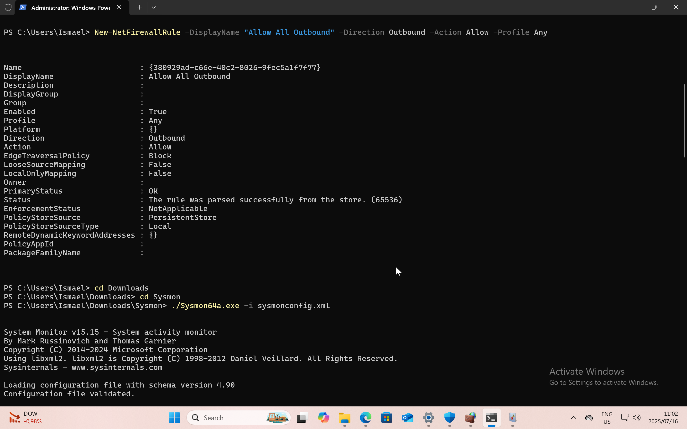

# 🚨 Lateral Movement & Remote Command Execution Detection Lab

**Simulating a realistic attack scenario with detection using Splunk and Sysmon**

---

## 📚 Table of Contents

- [🚨 Lateral Movement \& Remote Command Execution Detection Lab](#-lateral-movement--remote-command-execution-detection-lab)
	- [📚 Table of Contents](#-table-of-contents)
	- [📝 Overview](#-overview)
	- [🧰 Lab Setup](#-lab-setup)
	- [⚙️ Windows 11 Vulnerable Configuration](#️-windows-11-vulnerable-configuration)
- [Disable Defender](#disable-defender)
- [Disable Firewall](#disable-firewall)
- [Enable Admin Shares](#enable-admin-shares)
- [Enable command line logging](#enable-command-line-logging)
	- [🐾 Installing Sysmon](#-installing-sysmon)
	- [📈 Installing Splunk](#-installing-splunk)
	- [🛠️ Attack Simulation (Kali Linux)](#️-attack-simulation-kali-linux)
	- [🔎 Detection \& Analysis in Splunk](#-detection--analysis-in-splunk)
	- [🎯 Attack Mapping \& Interpretation](#-attack-mapping--interpretation)
	- [MITRE ATT\&CK Mapping](#mitre-attck-mapping)
	- [📂 Artifacts](#-artifacts)
	- [🔮 Next Steps \& Future Improvements](#-next-steps--future-improvements)
	- [➕ How to Contribute](#-how-to-contribute)
	- [🏁 Conclusion](#-conclusion)
	- [🔗 Credits \& Tools](#-credits--tools)
	- [📧 Connect with me:](#-connect-with-me)

---

## 📝 Overview

This project simulates a **lateral movement and remote code execution attack** from a Kali Linux machine against a Windows 11 target.  
The detection is performed using **Splunk** and **Sysmon**, creating a realistic scenario for Blue Team training and portfolio building.

---

🔧 Prerequisites

To successfully build and run this lab, ensure you have the following minimum hardware and software setup:

💻 Hardware Requirements

Resource	Minimum	Recommended
CPU	4 Cores	6+ Cores (for smoother virtualization)
RAM	8 GB	12–16 GB (for running multiple VMs)
Disk Space	60 GB free	100+ GB (due to VM snapshots, logs, Splunk data)

🖥️ Software Requirements
	•	Virtualization Software
	•	VirtualBox, VMware Workstation, VMware Fusion, or UTM (for Apple Silicon)
	•	Operating Systems
	•	Windows 11 VM (Victim)
	•	Kali Linux VM (Attacker)
	•	Splunk Enterprise (Free Trial or Developer Edition)
	•	Sysmon for detailed Windows event logging
	•	Sysinternals Sysmon

🌐 Networking
	•	Both VMs must be on the same network segment (use Bridged or Host-Only networking)
	•	Kali must be able to reach Windows over SMB (port 445) and RPC

---

## 🧰 Lab Setup

| Machine | Role |
|----------|------|
| **Kali Linux** | Attacker (Impacket, smbclient, CrackMapExec, etc.) |
| **Windows 11 VM** | Victim (Splunk, Sysmon, logging configured) |
| **Splunk Enterprise** | Log collection and analysis |

⚙️ Windows 11 Installation (Victim Machine)
	1.	Download Windows 11 ISO from Microsoft.
	2.	Create a Virtual Machine using VirtualBox, VMware or UTM with bridged or host-only networking.
	3.	Set up Administrator user, disable UAC popups, configure networking, and install Remote Desktop if needed.

🛠️ Kali Linux Setup (Attacker Machine)
	1.	Download Kali ISO from kali.org.
        2.     Update and upgrade Kali: 
sudo apt update && sudo apt upgrade -y
	3.	Install Impacket & Tools:
sudo apt install impacket crackmapexec smbclient
	4.	Set networking in VM to communicate with Windows (bridged, NAT or host-only).

---

## ⚙️ Windows 11 Vulnerable Configuration

**Disable security features to simulate a vulnerable environment:**

```powershell
# Disable Defender
Set-MpPreference -DisableRealtimeMonitoring $true
Set-MpPreference -DisableBehaviorMonitoring $true
Set-MpPreference -DisableBlockAtFirstSeen $true
Set-MpPreference -DisableIOAVProtection $true

# Disable Firewall
Set-NetFirewallProfile -Profile Domain,Public,Private -Enabled False

# Enable Admin Shares
reg add "HKLM\SOFTWARE\Microsoft\Windows\CurrentVersion\Policies\System" /v LocalAccountTokenFilterPolicy /t REG_DWORD /d 1 /f

🔍 Logging Configuration

Enable auditing policies:

AuditPol /set /subcategory:"Logon" /success:enable /failure:enable
AuditPol /set /subcategory:"Process Creation" /success:enable

# Enable command line logging
reg add "HKLM\Software\Microsoft\Windows\CurrentVersion\Policies\System\Audit" /v ProcessCreationIncludeCmdLine_Enabled /t REG_DWORD /d 1 /f

## 🐾 Installing Sysmon

Download Sysmon from:
https://learn.microsoft.com/en-us/sysinternals/downloads/sysmon

Download a pre-configured sysmonconfig.xml from Sysmon Modular.

Open PowerShell as Administrator and run: cd "C:\Users\Downloads\sysmon"

.\sysmon64.exe -i sysmonconfig.xml

Verify Sysmon is running:

Get-Process sysmon64



## 📈 Installing Splunk
	1.	Download Splunk Enterprise (Trial):

https://www.splunk.com/en_us/download/splunk-enterprise.html

	2.	Configure Splunk Inputs:

	•	WinEventLog: Security
	•	WinEventLog: System
	•	WinEventLog: Application
	•	Microsoft-Windows-PowerShell/Operational
	•	Sysmon Event Logs (if installed)

	3.	Verify event ingestion into Splunk

⸻

## 🛠️ Attack Simulation (Kali Linux)

1️⃣ Lateral Movement with impacket-psexec

impacket-psexec WORKGROUP/Administrator@192.168.56.10 -p <VICTIM_PORT_ex:445>

Generates:
	•	4624 (Logon Type 3) – Remote login

2️⃣ Accessing Admin Shares with smbclient

smbclient \\\\<Windows_IP>\\C$ -U Administrator

Generates:
	•	4624 (Logon Type 3) – SMB login
	•	5140 – Share access event

## 🔎 Detection & Analysis in Splunk

Detect Remote Logon (4624)

index=main sourcetype=WinEventLog:Security EventCode=4624 Logon_Type=3
| table _time Account_Name Source_Network_Address Workstation_Name Authentication_Package

Detect Process Creation (4688)

index=main sourcetype=WinEventLog:Security EventCode=4688
| table _time Account_Name New_Process_Name Process_Command_Line Parent_Process_Name

Correlate Lateral Movement and Execution

index=main sourcetype=WinEventLog:Security (EventCode=4624 OR EventCode=4688)
| eval event=case(EventCode==4624,"Network Logon", EventCode==4688,"Process Created")
| table _time event Account_Name Source_Network_Address New_Process_Name Process_Command_Line Parent_Process_Name

## 🎯 Attack Mapping & Interpretation

Event ID	Meaning	Attack Phase
4624 (Type 3)	Remote network logon	Lateral Movement
4688	Command execution (cmd.exe)	Post-exploitation
5140	SMB share accessed	Recon / Access

## MITRE ATT&CK Mapping

Tactic	Technique
Lateral Movement	T1021.002 - SMB/Windows Admin Shares
Execution	T1569.002 - Service Execution
Command Execution	T1059.003 - Windows Command Shell

## 📂 Artifacts

File/Folder	Description
README.md	Full lab documentation
screenshots/	Attack and detection screenshots
splunk_queries.txt	List of Splunk queries used
sysmonconfig.xml	Sysmon configuration (if customized)

## 🔮 Next Steps & Future Improvements

This lab is an initial step towards building a more comprehensive security operations and detection portfolio.
Here are the planned next steps and possible improvements:

🛠️ Planned Enhancements
	•	Add Real-Time Alerting
Configure Splunk alert rules to generate real-time notifications (email/webhook) for lateral movement and suspicious logons.
	•	Integrate MITRE ATT&CK Tags in Splunk Dashboards
Create custom dashboards that map the detected events directly to MITRE ATT&CK techniques.
	•	Use Splunk Enterprise Security or Open-Source SIEM Alternatives
Expand detection capabilities with pre-built correlation rules (if licensing permits).
	•	Include PowerShell Attack Simulation
Simulate Invoke-Mimikatz or remote PowerShell Remoting scenarios and analyze the logs generated.
	•	Expand to Cloud Monitoring
Integrate Azure or AWS event logs to simulate hybrid environment monitoring.
	•	Automate Lab Deployment
Use Terraform, Vagrant, or Ansible to automate lab creation for faster re-deployment.
	•	Contribute Sigma Rules
Convert the Splunk detection queries into Sigma format for SOC interoperability.

⸻

🧪 Learning Focus Areas
	•	Advanced Splunk SPL query development
	•	Detection engineering best practices
	•	Blue Team vs Red Team operational scenarios
	•	Threat hunting techniques based on endpoint telemetry

⸻

If you have suggestions, feel free to open an issue or collaborate!

⸻

## ➕ How to Contribute
	•	Fork the repo and submit a pull request
	•	Open issues for feature suggestions
	•	Share ideas for new attack-detection scenarios

⸻


## 🏁 Conclusion

This lab provides a practical, end-to-end scenario for detecting lateral movement and remote code execution using Windows logs, Sysmon, and Splunk.

Use this project to:
	•	Train as a SOC Analyst
	•	Build your cybersecurity portfolio
	•	Understand real-world attack detection pipelines

⸻

## 🔗 Credits & Tools
	•	Impacket – https://github.com/SecureAuthCorp/impacket
	•	Sysmon – https://learn.microsoft.com/en-us/sysinternals/downloads/sysmon
	•	Splunk – https://www.splunk.com/
	

⸻

## 📧 Connect with me:

Feel free to connect with me for collaboration or feedback.

https://www.linkedin.com/in/ismael-jr-coulibaly-85b680240

https://github.com/smozz-blessed